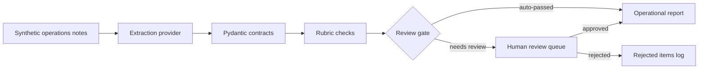

# AI Workflow Builder Case Study


Clean-room kernel of an internal operations AI workflow: synthetic notes become structured insights, validation checks, a human review gate, and an operational report.

## Why

LLM output should be treated as untrusted operational data until it is validated and reviewed. This case study shows a small offline workflow for converting synthetic rollout, access, integration, reporting, and data-quality notes into structured outputs. The point is not model research; the point is workflow discipline that an operations lead can run, inspect, and audit.

## Quickstart

```bash
uv sync --all-extras
uv run awb demo
uv run pytest -q
```

The demo is fully offline. It uses a deterministic fake provider so local runs and CI stay reproducible without API keys.

## Architecture



## What This Demonstrates

- Repeatable CLI workflow.
- Pydantic contracts for structured outputs.
- Rubric checks for confidence, actionability, and unsafe overconfidence.
- Human-in-the-loop review gate: AI output cannot approve itself.
- Privacy and data-boundary discipline with synthetic fixtures only.
- CI guardrails with ruff, pytest, and gitleaks.

## Example Commands

```bash
uv run awb analyze examples/synthetic_ops_notes.json -o out/demo
uv run awb review list -o out/demo
uv run awb review approve N-1004 -o out/demo
uv run awb report -o out/demo
```

## Provenance And Honesty

This repository is a distilled clean-room kernel of a larger private project that runs on real, privacy-sensitive data. It was rebuilt from scratch with synthetic data only; it is a case study, not a production system.

Real-model integration lives in the private system. This public kernel keeps the default path offline and deterministic for review and CI. The optional LiteLLM adapter marks the provider boundary without requiring credentials or network calls.

## Boundaries

See [PRIVACY.md](PRIVACY.md) for the data boundary model and [AGENTS.md](AGENTS.md) for rules for AI-assisted edits. Public examples are synthetic; real inputs, live outputs, local databases, credentials, and private notes do not belong in this repository.

## Roadmap

- Hybrid keyword plus semantic search over internal knowledge notes.
- Vector database adapter around the same validation and review boundary.
- MCP server interface for workflow tools and report resources.
- Real LLM provider via the optional LiteLLM extra, keeping offline CI as the default.
