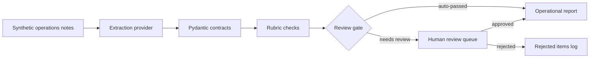

# AI Workflow Builder Case Study


An offline case study of the reliability layer around AI-assisted operational workflows:
typed outputs, validation rubrics, human review, deterministic evaluation, and auditable
reporting.

## Start Here

- [Run the offline demo with locked commands](#the-demo-story).
- [Review the deterministic evaluation evidence](#evaluation-evidence-v02).
- [Read the privacy boundary](PRIVACY.md).
- [Open the committed Workflow Explorer](docs/workflow-explorer/index.html).

## Why

LLM output should be treated as untrusted operational data until it is validated and reviewed. This case study shows a small offline workflow for converting synthetic rollout, access, integration, reporting, and data-quality notes into structured outputs. The point is not model research; the point is workflow discipline that an operations lead can run, inspect, and audit.

## The Demo Story

Picture one operations lead at the end of a rollout week. Ten synthetic notes have arrived from
chat, portal, survey, and field channels: a dashboard that does not match its source export, a
coordinator locked out of the admin workspace, a webhook that fails on new tasks, a vague survey
comment, and more. The lead needs these turned into something they can triage and defend, not a pile
of raw model text.

The offline demo walks that exact path in four steps:

1. **Note conversion.** Each synthetic note is converted into a structured insight — category,
   sentiment, a short summary, and suggested action items — by the deterministic offline provider.
2. **Validation checks.** Rubric checks flag low confidence, negative tone without an action item,
   and unsafe overconfident language before anything is trusted.
3. **Review gate (human decision point).** Flagged insights are queued for a person. AI output cannot
   promote itself into the report's `Included Insights` section: the lead approves or rejects each
   queued item, and that human decision controls entry into `Included Insights`. In this run, two
   low-confidence notes (`N-1004`, `N-1008`) are held for review while the confident eight auto-pass.
4. **Report inspection.** The lead reads one operational report that is fully auditable. Auto-passed
   and human-approved insights appear under `Included Insights`, while pending and rejected items
   remain visible in their own `Pending Review` and `Rejected Items` status sections — so the report
   shows both what was accepted and what was held back or declined.

Run the whole story with locked dependencies:

```bash
uv sync --locked --all-extras
uv run --locked awb demo
uv run --locked pytest -q
```

The first command, `uv sync --locked --all-extras`, may download packages from your package index on
a fresh machine; it resolves strictly against the committed lock file. Once that locked environment
is available, `awb demo` and the tests run with no external APIs, model calls, or credentials.
`awb demo` reports `Insights: 10` and `Queued for review: 2`, and writes the report to
`out/demo/report.md`.

### Synthetic Inputs, Outputs, and Constraints

- **Inputs are synthetic.** The bundled notes in `examples/synthetic_ops_notes.json` are invented for
  this case study; no real operational data is used.
- **Outputs are synthetic and illustrative.** See
  [examples/synthetic_demo_report.md](examples/synthetic_demo_report.md) for illustrative synthetic
  evidence of what the demo produces — it is a committed reference, not real output.
- **Human decision points are explicit.** Auto-passed insights enter the report's `Included Insights`
  section directly, but no queued or flagged insight enters `Included Insights` without explicit human
  approval. Flagged items are never hidden — pending and rejected items stay visible in their own
  status sections for auditability.
- **Case-study constraints.** Dependency setup (`uv sync --locked --all-extras`) may reach your
  package index on a fresh machine, but the demo execution itself is offline and deterministic — the
  `DeterministicRuleProvider` makes no external API or model calls and needs no credentials, so local
  runs and CI stay reproducible. This is a case study, not a production system, and it makes no
  accuracy or production claims.

## Architecture



## Workflow Explorer

Open the committed [Workflow Explorer](docs/workflow-explorer/index.html) directly through
`file://` to inspect all ten RUN traces, the accepted BUILD process, and the completed #9 → #10
evidence trace. Rebuild or verify the deterministic offline artifact with locked dependencies:

```bash
uv run --locked python docs/workflow-explorer/build.py
uv run --locked python docs/workflow-explorer/build.py --check
```

## Evidence Through Three Lenses

- **Applied AI and workflow engineering.** The offline CLI turns synthetic operations notes into
  Pydantic-validated insights, applies rubric checks, routes flagged items to a human review gate,
  and produces an auditable report with included, pending, and rejected states.
- **AI QA and evaluation discipline.** Suite A and Suite B reproduce separate deterministic
  conformance contracts against authored synthetic expectations; they do not measure model
  accuracy, quality, or generalization.
- **Technical implementation and supportability.** Locked dependencies, explicit CLI entry
  points, pytest, Ruff, gitleaks, CI, and a deterministic Workflow Explorer build make the case
  study inspectable and reproducible without external APIs or credentials.

## Example Commands

```bash
uv run awb analyze examples/synthetic_ops_notes.json -o out/demo
uv run awb review list -o out/demo
uv run awb review approve N-1004 -o out/demo
uv run awb report -o out/demo
```

## Provenance And Honesty

This repository is a distilled clean-room kernel of a larger private project that runs on real, privacy-sensitive data. It was rebuilt from scratch with synthetic data only; it is a case study, not a production system.

This public kernel keeps the default path offline and deterministic for review and CI: insight extraction is performed by the `DeterministicRuleProvider` (keyword and rule based), while the separate rubric validators — not the provider — flag low confidence, a negative-sentiment insight that carries no action item, and overconfident summary language. No real-model provider or network adapter is bundled here. Only the pinned dependency bootstrap (`uv sync --locked`) may reach the public package registry; application, demo, and test execution are fully offline afterward, with no model or API calls and no credentials.

## Authorship and AI Assistance

The owner defined the outcome, boundaries, acceptance criteria, and final decisions for this case
study. Coding agents contributed to analysis, implementation, verification support, and review
under repository-recorded roles and task contracts. The owner reviewed and accepted the published
claims and remains accountable for the release. This does not imply that the owner manually wrote
every line or that agent output was accepted without human review.

## What This Does Not Prove

This repository does not demonstrate learned-model accuracy, model generalization, production
readiness, commercial scale, clinical usefulness, or a hosted live system. Its provider is a fixed
rule engine, its corpus is small and synthetic, and its evaluation results are deterministic
conformance checks against authored expectations.

## Evaluation Evidence (v0.2)

Deterministic, synthetic evaluation evidence for this kernel is versioned under `evals/`. Reproduce it locally with locked commands:

```bash
uv sync --locked --all-extras
uv run --locked awb eval
uv run --locked awb eval --format json
uv run --locked awb eval --check
```

- **Suite A (pipeline conformance): 12/12** cases conformant (12 correct of 12 total).
- **Suite B (validator-rubric behavior): 6/6** cases conformant (6 correct of 6 total).

Suite A and Suite B are reported separately, with independent denominators; there is no combined cross-suite score and no blended headline metric.

These numbers are deterministic conformance against authored synthetic expectations, not model accuracy, model quality, generalization, or a production benchmark: the provider is a fixed rule engine, so exact reproduction is the correct and expected contract, not an achievement.

Accepted limitations: the corpus is a small synthetic corpus, the provider is a fixed rule provider with no learned model, and this case study makes no production-quality claim. See [evals/README.md](evals/README.md) for the full accepted corpus, labels, gates, counts, and methodology.

## Boundaries

See [PRIVACY.md](PRIVACY.md) for the data boundary model and [AGENTS.md](AGENTS.md) for rules for AI-assisted edits. Public examples are synthetic; real inputs, live outputs, local databases, credentials, and private notes do not belong in this repository.

## Maintenance Status

After `v0.2.0`, this repository is maintained as a frozen case study. Future changes are limited
to correctness, security, dependency, and factual documentation fixes unless a separately
approved scope reopens feature work.
