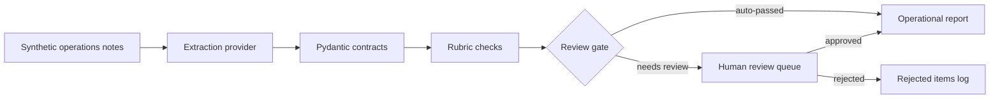

# AI Workflow Builder Case Study


Clean-room kernel of an internal operations AI workflow: synthetic notes become structured insights, validation checks, a human review gate, and an operational report.

## Why

LLM output should be treated as untrusted operational data until it is validated and reviewed. This case study shows a small offline workflow for converting synthetic rollout, access, integration, reporting, and data-quality notes into structured outputs. The point is not model research; the point is workflow discipline that an operations lead can run, inspect, and audit.

## The Demo Story

Picture one operations lead at the end of a rollout week. Ten synthetic notes have arrived from
chat, portal, survey, and field channels: a dashboard that does not match its source export, a
coordinator locked out of the admin workspace, a webhook that fails on new tasks, a vague survey
comment, and more. The lead needs these turned into something they can triage and defend, not a pile
of raw model text.

The offline demo walks that exact path in four steps:

1. **Note conversion.** Each synthetic note is converted into a structured insight — category,
   sentiment, a short summary, and suggested action items — by the deterministic offline provider.
2. **Validation checks.** Rubric checks flag low confidence, negative tone without an action item,
   and unsafe overconfident language before anything is trusted.
3. **Review gate (human decision point).** Flagged insights are queued for a person. AI output cannot
   promote itself into the report's `Included Insights` section: the lead approves or rejects each
   queued item, and that human decision controls entry into `Included Insights`. In this run, two
   low-confidence notes (`N-1004`, `N-1008`) are held for review while the confident eight auto-pass.
4. **Report inspection.** The lead reads one operational report that is fully auditable. Auto-passed
   and human-approved insights appear under `Included Insights`, while pending and rejected items
   remain visible in their own `Pending Review` and `Rejected Items` status sections — so the report
   shows both what was accepted and what was held back or declined.

Run the whole story with locked dependencies:

```bash
uv sync --locked --all-extras
uv run --locked awb demo
uv run --locked pytest -q
```

The first command, `uv sync --locked --all-extras`, may download packages from your package index on
a fresh machine; it resolves strictly against the committed lock file. Once that locked environment
is available, `awb demo` and the tests run with no external APIs, model calls, or credentials.
`awb demo` reports `Insights: 10` and `Queued for review: 2`, and writes the report to
`out/demo/report.md`.

### Synthetic Inputs, Outputs, and Constraints

- **Inputs are synthetic.** The bundled notes in `examples/synthetic_ops_notes.json` are invented for
  this case study; no real operational data is used.
- **Outputs are synthetic and illustrative.** See
  [examples/synthetic_demo_report.md](examples/synthetic_demo_report.md) for illustrative synthetic
  evidence of what the demo produces — it is a committed reference, not real output.
- **Human decision points are explicit.** Auto-passed insights enter the report's `Included Insights`
  section directly, but no queued or flagged insight enters `Included Insights` without explicit human
  approval. Flagged items are never hidden — pending and rejected items stay visible in their own
  status sections for auditability.
- **Case-study constraints.** Dependency setup (`uv sync --locked --all-extras`) may reach your
  package index on a fresh machine, but the demo execution itself is offline and deterministic — a
  fake provider makes no external API or model calls and needs no credentials, so local runs and CI
  stay reproducible. This is a case study, not a production system, and it makes no accuracy or
  production claims.

## Architecture



## What This Demonstrates

- Repeatable CLI workflow.
- Pydantic contracts for structured outputs.
- Rubric checks for confidence, actionability, and unsafe overconfidence.
- Human-in-the-loop review gate: AI output cannot approve itself.
- Privacy and data-boundary discipline with synthetic fixtures only.
- CI guardrails with ruff, pytest, and gitleaks.

## Example Commands

```bash
uv run awb analyze examples/synthetic_ops_notes.json -o out/demo
uv run awb review list -o out/demo
uv run awb review approve N-1004 -o out/demo
uv run awb report -o out/demo
```

## Provenance And Honesty

This repository is a distilled clean-room kernel of a larger private project that runs on real, privacy-sensitive data. It was rebuilt from scratch with synthetic data only; it is a case study, not a production system.

Real-model integration lives in the private system. This public kernel keeps the default path offline and deterministic for review and CI. The optional LiteLLM adapter marks the provider boundary without requiring credentials or network calls.

## Boundaries

See [PRIVACY.md](PRIVACY.md) for the data boundary model and [AGENTS.md](AGENTS.md) for rules for AI-assisted edits. Public examples are synthetic; real inputs, live outputs, local databases, credentials, and private notes do not belong in this repository.
